Geo estadística univariada - GeoR
================

# Parte descriptiva

## Cargar librerias

Lista de librerías con link a la documentación.

  - [fields](https://cran.r-project.org/web/packages/fields/fields.pdf)
  - [geoR](https://cran.r-project.org/web/packages/geoR/geoR.pdf)
  - [akima](https://cran.r-project.org/web/packages/akima/akima.pdf)
    Usado para gráficos descriptivos

## Lectura de datos

``` r
aquifer <- read.table("aquifer.txt", head = TRUE, dec = ",")
head(aquifer)
summary(aquifer)
```

Encabezado datos aquifer

|       Este |     Norte | Profundidad |
| ---------: | --------: | ----------: |
|   42.78275 | 127.62282 |        1464 |
| \-27.39691 |  90.78732 |        2553 |
|  \-1.16289 |  84.89600 |        2158 |
| \-18.61823 |  76.45199 |        2455 |
|   96.46549 |  64.58058 |        1756 |
|  108.56243 |  82.92325 |        1702 |

Summary datos aquifer

|  | Este            | Norte           | Profundidad  |
| :- | :-------------- | :-------------- | :----------- |
|  | Min. :-145.24   | Min. : 9.414    | Min. :1024   |
|  | 1st Qu.: -21.30 | 1st Qu.: 33.682 | 1st Qu.:1548 |
|  | Median : 11.66  | Median : 59.158 | Median :1797 |
|  | Mean : 16.89    | Mean : 79.361   | Mean :2002   |
|  | 3rd Qu.: 70.90  | 3rd Qu.:131.825 | 3rd Qu.:2540 |
|  | Max. : 112.80   | Max. :184.766   | Max. :3571   |

## GEO\_Data

### Convertir aquifer a un objeto geodata (geoR obj)

  - Documentacion
    [as.geodata](https://cran.r-project.org/web/packages/geoR/geoR.pdf#page=5)

<!-- end list -->

``` r
aquiferg <- as.geodata(aquifer)
summary(aquiferg)
```

    ## Number of data points: 85 
    ## 
    ## Coordinates summary
    ##          Este     Norte
    ## min -145.2365   9.41441
    ## max  112.8045 184.76636
    ## 
    ## Distance summary
    ##         min         max 
    ##   0.2211656 271.0615463 
    ## 
    ## Data summary
    ##     Min.  1st Qu.   Median     Mean  3rd Qu.     Max. 
    ## 1024.000 1548.000 1797.000 2002.282 2540.000 3571.000

### Gráfico de objeto geodata

  - Documentación
    [plotgeodata](https://cran.r-project.org/web/packages/geoR/geoR.pdf#page=85)

Gráfico del objeto geodata

``` r
plot(aquiferg, qt.col = c("purple",
                         "pink",
                         "green",
                         "yellow"))
```

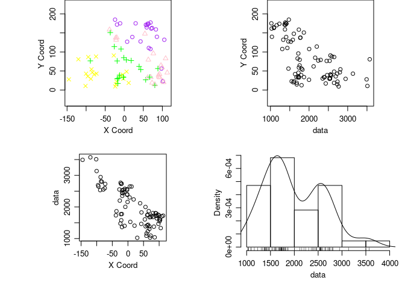<!-- -->

Gráfico con el parametro 3d

``` r
plot(aquiferg, scatter3d = T)
```

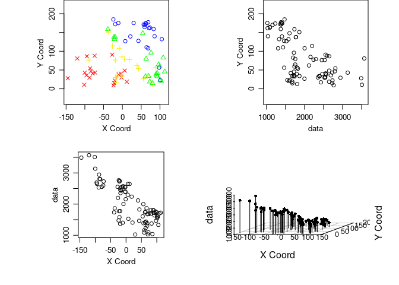<!-- -->

Gráfico removiendo la tendencia (trend )

``` r
plot(aquiferg, trend = "1st")
```

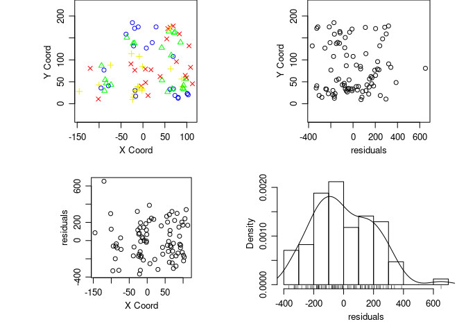<!-- -->

``` r
# plot(aquiferg, trend = ~ aquiferg$coords)
#plot(aquiferg, trend = "2nd")
```

### Gráficos descriptivos interpolación

  - Documentacion Interpolación
    [inderp](https://cran.r-project.org/web/packages/akima/akima.pdf#page=14)
  - Documentacion
    [persp](https://www.rdocumentation.org/packages/graphics/versions/3.6.2/topics/persp)
  - Documentacion
    [drape.plot](https://cran.r-project.org/web/packages/fields/fields.pdf#page=36)

<!-- end list -->

``` r
par(mfrow = c(2, 2),
    mar = c(3, 3, 1, 1),
    mgp = c(2, 1, 0))
# Esta función agrupa los siguientes gráficos en
# una matrix 2x2

grillas <- interp(aquifer$Este,
                  aquifer$Norte,
                  aquifer$Profundidad)

persp(grillas$x,
      grillas$y,
      grillas$z,
      xlab = "Este",
      ylab = "Norte",
      zlab = "Nivel freatico",
      phi = 30,
      theta = 20,
      col = "lightblue",
      expand = .5,
      ticktype = "detailed")

drape.plot(grillas$x,
           grillas$y,
           grillas$z,
           xlab = "Este",
           ylab = "Norte",
           zlab = "z",
           theta = 45,
           col = topo.colors(64),
           expand = .5,
           ticktype = "detailed")


drape.plot(grillas$x,
           grillas$y,
           grillas$z,
           xlab = "Este",
           ylab = "Norte",
           zlab = "z",
           theta = -10,
           col = topo.colors(64),
           expand = .5,
           ticktype = "detailed")


drape.plot(grillas$x,
           grillas$y,
           grillas$z,
           xlab = "Este",
           ylab = "Norte",
           zlab = "z",
           theta = 60,
           col = topo.colors(64),
           expand = .5,
           ticktype = "detailed")
```

<!-- -->

### Gráficos de contorno

  - Documentacion
    [contour](https://www.rdocumentation.org/packages/graphics/versions/3.6.2/topics/contour)
  - Documentacion
    [filled.contour](https://www.rdocumentation.org/packages/graphics/versions/3.6.2/topics/filled.contour)

<!-- end list -->

``` r
par(mfrow = c(2, 1),
    mar = c(1,1,1,1))

contour(grillas, nlevels = 10, main = "Contorno")
image(grillas$z, main =  "Grilla")
```

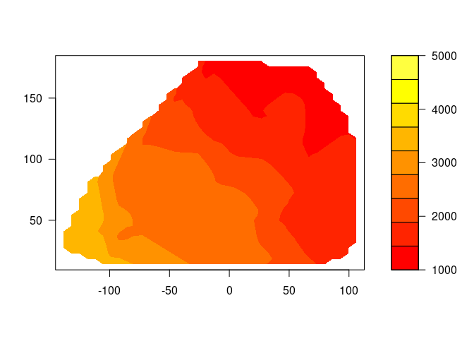<!-- -->

``` r
filled.contour(grillas, levels = seq(1000,
                                     5000,
                                     len = 10),
               col = heat.colors(10),
                main = "grilla niveles")
```

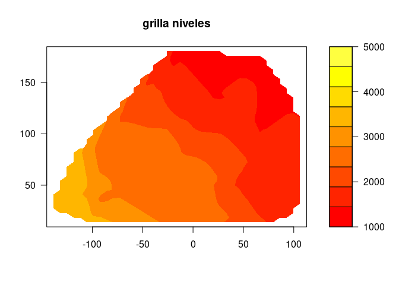<!-- -->

### Funciones y gráficas a partir de la ufnción outer

``` r
h <- seq(0, 1, len = 50)
u <- seq(0, 1, len = 50)

ejemplo1CH  <- function(h, u, sigma, a, b, c, d, delta) {
    (sigma^2/((a^2*u^2+c)^(d/2)))*exp(-(b^2*h^2)/(a^2*u^2+c))*exp(-delta*u^2)
    }
h <- seq(0, 1, len = 20)
u <- seq(1, 10, len = 20)
f <- outer(h, u, ejemplo1CH, sigma=3, a=1, b=3, c=1, d=2, delta=0)

par(mfrow = c(2, 2),
    mar = c(3, 3, 1, 1),
    mgp = c(2, 1, 0))

drape.plot(h,
           u,
           f,
           main = "Cressie-Huang; 1 (25,1,0.6)",
           xlab = "h",
           ylab = "u",
           zlab = "Covarianza",
           ltheta = 75,
           col = terrain.colors(64))

drape.plot(h,
           u,
           f,
           main = "Cressie-Huang; 1 (25,1,0.6)",
           xlab = "h",
           ylab = "u",
           zlab = "Covarianza",
           theta = -150,
           col = terrain.colors(64))
persp(h,
      u,
      f,
      main = "Cressie-Huang; 1 (25,1,0.6)",
      xlab = "h",
      ylab = "u",
      zlab = "Covarianza",
      ltheta = 75)

contour(h,
        u,
        f,
        col = topo.colors(10),
        xlim = c(0,0.6))
```

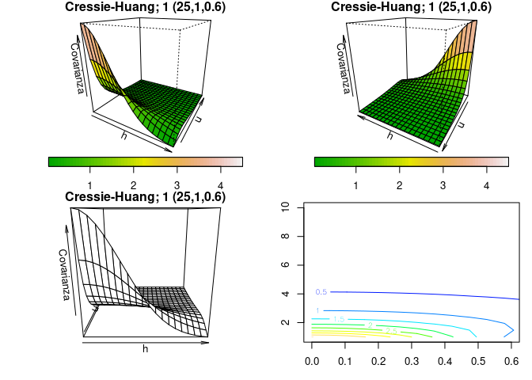<!-- -->

# Estimar diferentes tipos de regresión

## Primer modelo

``` r
reg1 <- lm(Profundidad ~ Este + Norte, data = aquifer)
residuales1  <-  residuals(reg1)
summary(reg1)
anova(reg1)
```

    ## 
    ## Call:
    ## lm(formula = Profundidad ~ Este + Norte, data = aquifer)
    ## 
    ## Residuals:
    ##     Min      1Q  Median      3Q     Max 
    ## -366.96 -161.53  -30.71  148.15  651.20 
    ## 
    ## Coefficients:
    ##              Estimate Std. Error t value Pr(>|t|)    
    ## (Intercept) 2591.4302    38.9599   66.52   <2e-16 ***
    ## Este          -6.7514     0.3438  -19.64   <2e-16 ***
    ## Norte         -5.9872     0.4066  -14.73   <2e-16 ***
    ## ---
    ## Signif. codes:  0 '***' 0.001 '**' 0.01 '*' 0.05 '.' 0.1 ' ' 1
    ## 
    ## Residual standard error: 203.3 on 82 degrees of freedom
    ## Multiple R-squared:  0.8921, Adjusted R-squared:  0.8894 
    ## F-statistic: 338.9 on 2 and 82 DF,  p-value: < 2.2e-16

    ## Analysis of Variance Table
    ## 
    ## Response: Profundidad
    ##           Df   Sum Sq  Mean Sq F value    Pr(>F)    
    ## Este       1 19045642 19045642  460.95 < 2.2e-16 ***
    ## Norte      1  8960172  8960172  216.86 < 2.2e-16 ***
    ## Residuals 82  3388069    41318                      
    ## ---
    ## Signif. codes:  0 '***' 0.001 '**' 0.01 '*' 0.05 '.' 0.1 ' ' 1

## Segundo modelo

``` r
reg2 <- lm(Profundidad ~ Este + Norte +
           I(Este^2) + I(Norte^2) +
           I(Este * Norte),
           data = aquifer)
residuales2  <-  residuals(reg2)
summary(reg2)
anova(reg2)
```

    ## 
    ## Call:
    ## lm(formula = Profundidad ~ Este + Norte + I(Este^2) + I(Norte^2) + 
    ##     I(Este * Norte), data = aquifer)
    ## 
    ## Residuals:
    ##     Min      1Q  Median      3Q     Max 
    ## -407.43 -138.76   -5.74  128.84  648.16 
    ## 
    ## Coefficients:
    ##                   Estimate Std. Error t value Pr(>|t|)    
    ## (Intercept)      2.481e+03  6.813e+01  36.424  < 2e-16 ***
    ## Este            -8.374e+00  5.525e-01 -15.157  < 2e-16 ***
    ## Norte           -2.043e+00  1.764e+00  -1.159 0.250146    
    ## I(Este^2)        1.417e-03  4.987e-03   0.284 0.777096    
    ## I(Norte^2)      -2.464e-02  9.298e-03  -2.650 0.009708 ** 
    ## I(Este * Norte)  2.680e-02  7.413e-03   3.616 0.000526 ***
    ## ---
    ## Signif. codes:  0 '***' 0.001 '**' 0.01 '*' 0.05 '.' 0.1 ' ' 1
    ## 
    ## Residual standard error: 185.9 on 79 degrees of freedom
    ## Multiple R-squared:  0.9131, Adjusted R-squared:  0.9076 
    ## F-statistic:   166 on 5 and 79 DF,  p-value: < 2.2e-16

    ## Analysis of Variance Table
    ## 
    ## Response: Profundidad
    ##                 Df   Sum Sq  Mean Sq  F value    Pr(>F)    
    ## Este             1 19045642 19045642 551.3469 < 2.2e-16 ***
    ## Norte            1  8960172  8960172 259.3855 < 2.2e-16 ***
    ## I(Este^2)        1    55368    55368   1.6028 0.2092235    
    ## I(Norte^2)       1   152170   152170   4.4051 0.0390253 *  
    ## I(Este * Norte)  1   451567   451567  13.0723 0.0005259 ***
    ## Residuals       79  2728964    34544                       
    ## ---
    ## Signif. codes:  0 '***' 0.001 '**' 0.01 '*' 0.05 '.' 0.1 ' ' 1

## Tercer modelo

``` r
reg3 <- lm(Profundidad ~ Este * Norte,
           data = aquifer)
residuales3  <-  residuals(reg3)
summary(reg3)
anova(reg3)
```

    ## 
    ## Call:
    ## lm(formula = Profundidad ~ Este * Norte, data = aquifer)
    ## 
    ## Residuals:
    ##     Min      1Q  Median      3Q     Max 
    ## -406.30 -138.88  -13.04  129.36  722.48 
    ## 
    ## Coefficients:
    ##               Estimate Std. Error t value Pr(>|t|)    
    ## (Intercept)  2.627e+03  3.833e+01  68.546  < 2e-16 ***
    ## Este        -8.287e+00  5.658e-01 -14.646  < 2e-16 ***
    ## Norte       -6.649e+00  4.327e-01 -15.366  < 2e-16 ***
    ## Este:Norte   2.452e-02  7.401e-03   3.314  0.00138 ** 
    ## ---
    ## Signif. codes:  0 '***' 0.001 '**' 0.01 '*' 0.05 '.' 0.1 ' ' 1
    ## 
    ## Residual standard error: 191.9 on 81 degrees of freedom
    ## Multiple R-squared:  0.905,  Adjusted R-squared:  0.9014 
    ## F-statistic: 257.1 on 3 and 81 DF,  p-value: < 2.2e-16

    ## Analysis of Variance Table
    ## 
    ## Response: Profundidad
    ##            Df   Sum Sq  Mean Sq F value    Pr(>F)    
    ## Este        1 19045642 19045642  517.06 < 2.2e-16 ***
    ## Norte       1  8960172  8960172  243.25 < 2.2e-16 ***
    ## Este:Norte  1   404448   404448   10.98  0.001379 ** 
    ## Residuals  81  2983621    36835                      
    ## ---
    ## Signif. codes:  0 '***' 0.001 '**' 0.01 '*' 0.05 '.' 0.1 ' ' 1

# Estimación del semivariográma empirico

  - Documentacion
    [variog](https://cran.r-project.org/web/packages/geoR/geoR.pdf#page=133)

<!-- end list -->

``` r
vari2 <- variog(aquiferg, trend = "1st")
vari2Cloud <- variog(aquiferg, op = "cloud", trend = "1st")
vari2BinCloud <- variog(aquiferg,
                       max.dist = 200,
                       op = "cloud",
                       bin.cloud = TRUE)
vari2Sm <- variog(aquiferg,
                  trend = "1st",
                  op = "sm",
                  band=11)
```

``` r
par(mfrow = c(2, 2), mar = c(3, 3, 1, 1), mgp = c(2, 1, 0))
     plot(vari2, main = "binned variogram")
     plot(vari2Cloud, main = "variogram cloud")
     plot(vari2BinCloud,main = "clouds for binned variogram")
     plot(vari2Sm, main = "smoothed variogram")
```

<!-- -->

### Explorando estimación clásica, removiendo tendencia

``` r
vari1 <- variog(aquiferg)
vari2 <- variog(aquiferg, trend = "1st")
vari3 <- variog(aquiferg, trend = "2nd")
```

``` r
plot(vari1, main = "Sin remover tendencia")
```

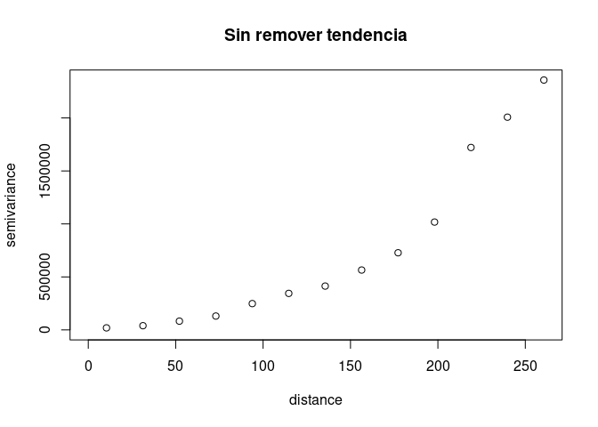<!-- -->

``` r
plot(vari2, main  = "Trend 1 ")
```

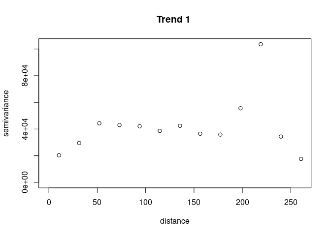<!-- -->

``` r
plot(vari3, main  = "Trend 2 ")
```

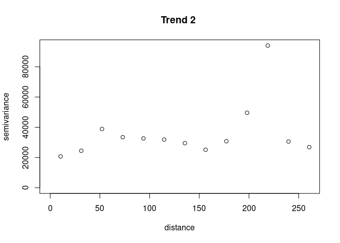<!-- -->

### Explorando estimación “Modulos”, removiendo tendencia

``` r
vari1 <- variog(aquiferg, estimator.type = "modulus")
vari2 <- variog(aquiferg, trend = "1st", estimator.type = "modulus")
vari3 <- variog(aquiferg, trend = "2nd", estimator.type = "modulus")
```

``` r
plot(vari1, main = "Sin remover tendencia")
```

<!-- -->

``` r
plot(vari2, main  = "Trend 1 ")
```

<!-- -->

``` r
plot(vari3, main  = "Trend 2 ")
```

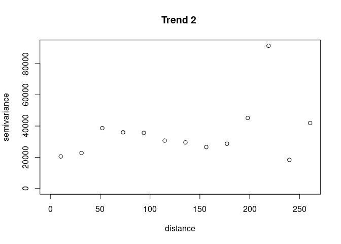<!-- -->

### Explorando posible anisotropia

``` r
vari_0 <- variog(aquiferg,
                 trend = "1st",
                 max.dist = 200,
                 dir = 0)

vari_45 <- variog(aquiferg,
                  trend = "1st",
                  max.dist = 200,
                  dir = pi / 4)
vari_90 <- variog(aquiferg,
                  trend = "1st",
                  max.dist = 200,
                  dir = pi / 2)
vari_135 <- variog(aquiferg,
                   trend = "1st",
                   max.dist = 200,
                   dir = 3 * pi / 4)
par(mfrow = c(2, 2),
    mar = c(3, 3, 1, 1),
    mgp = c(2, 1, 0))

plot(vari_0, main = "vari 0")
plot(vari_45, main = "vari 45")
plot(vari_90, main = "vari 90")
plot(vari_135, main = "vari 195")
```

<!-- -->

# Estimación teórica del semivariograma.

  - Documentación
    [eyefit](https://cran.r-project.org/web/packages/geoR/geoR.pdf#page=25)
  - Documentación
    [variofit](https://cran.r-project.org/web/packages/geoR/geoR.pdf#page=129)
  - Documentación
    [likfit](https://cran.r-project.org/web/packages/geoR/geoR.pdf#page=60)

<!-- end list -->

``` r
var1 <- variog(aquiferg,trend="1st",max.dist=200)


#ini1 <- eyefit(var1)
#cov.model  sigmasq phi   tausq kappa kappa2   practicalRange
#1      wave 30805.52  13 8984.94  <NA>   <NA> 38.8889336320589
ini1 <- c(30805.52, 13)
fitvar1 <- variofit(var1,
                    cov.model = "wave",
                    ini1,
                    fix.nugget = TRUE,
                    nugget = 8984.94,
                    wei = "equal")

fitvar2 <- variofit(var1,
                    cov.model = "wave",
                    ini1,
                    fix.nugget = TRUE,
                    nugget = 8984.94,
                    wei = "npairs")

fitvar3 <- variofit(var1,
                    ini1,
                    fix.nugget = TRUE,
                    nugget = 8984.94,
                    wei = "cressie")


fitvar4 <- likfit(aquiferg,
                  coords = aquiferg$coords,
                  data = aquiferg$data,
                  trend = "1st",
                  ini.cov.pars = ini1,
                  fix.nugget = T,
                  nugget = 8984.94,
                  cov.model = "wave",
                  lik.method = "ML")

fitvar5 <- likfit(aquiferg,
                  coords = aquiferg$coords,
                  data = aquiferg$data,
                  trend = "1st",
                  ini.cov.pars = ini1,
                  fix.nugget = T,
                  nugget = 8984.94,
                  cov.model = "wave",
                  lik.method = "REML")
```

``` r
plot(var1,
     xlab = "h",
     ylab = "semivarianza",
     cex.lab = 1.3,
     cex.axis = 1.2,
     main = "Estimación teórica del modelo de semivariograma",
     col.main = 4, cex.main =1.3)
lines(fitvar1, col = 1)
lines(fitvar2, col = 2)
lines(fitvar3, col = 3)
lines(fitvar4, col = 4)
lines(fitvar5, col = 5)
legend(130, 18000,
       c("MCO", "MCPnpairs", "MCPcressie", "ML", "REML"),
       lwd = 2,
       lty = 2:7,
       col = 2:7,
       box.col = 9,
       text.col = 2:7)
```

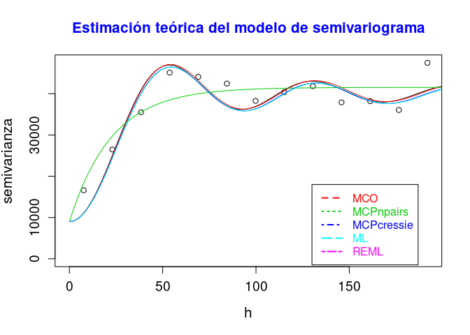<!-- -->

# Resultados.

``` r
summary(fitvar1)
```

    ## $pmethod
    ## [1] "OLS (ordinary least squares)"
    ## 
    ## $cov.model
    ## [1] "wave"
    ## 
    ## $spatial.component
    ##     sigmasq         phi 
    ## 31203.33666    11.93873 
    ## 
    ## $spatial.component.extra
    ## kappa 
    ##   0.5 
    ## 
    ## $nugget.component
    ##   tausq 
    ## 8984.94 
    ## 
    ## $fix.nugget
    ## [1] TRUE
    ## 
    ## $fix.kappa
    ## [1] TRUE
    ## 
    ## $practicalRange
    ## [1] 35.71419
    ## 
    ## $sum.of.squares
    ##     value 
    ## 159338722 
    ## 
    ## $estimated.pars
    ##     sigmasq         phi 
    ## 31203.33666    11.93873 
    ## 
    ## $weights
    ## [1] "equal"
    ## 
    ## $call
    ## variofit(vario = var1, ini.cov.pars = ini1, cov.model = "wave", 
    ##     fix.nugget = TRUE, nugget = 8984.94, weights = "equal")
    ## 
    ## attr(,"class")
    ## [1] "summary.variomodel"

``` r
summary(fitvar2)
```

    ## $pmethod
    ## [1] "WLS (weighted least squares)"
    ## 
    ## $cov.model
    ## [1] "wave"
    ## 
    ## $spatial.component
    ##     sigmasq         phi 
    ## 31311.81332    12.05997 
    ## 
    ## $spatial.component.extra
    ## kappa 
    ##   0.5 
    ## 
    ## $nugget.component
    ##   tausq 
    ## 8984.94 
    ## 
    ## $fix.nugget
    ## [1] TRUE
    ## 
    ## $fix.kappa
    ## [1] TRUE
    ## 
    ## $practicalRange
    ## [1] 36.07688
    ## 
    ## $sum.of.squares
    ##       value 
    ## 32922890311 
    ## 
    ## $estimated.pars
    ##     sigmasq         phi 
    ## 31311.81332    12.05997 
    ## 
    ## $weights
    ## [1] "npairs"
    ## 
    ## $call
    ## variofit(vario = var1, ini.cov.pars = ini1, cov.model = "wave", 
    ##     fix.nugget = TRUE, nugget = 8984.94, weights = "npairs")
    ## 
    ## attr(,"class")
    ## [1] "summary.variomodel"

``` r
summary(fitvar3)
```

    ## $pmethod
    ## [1] "WLS (weighted least squares)"
    ## 
    ## $cov.model
    ## [1] "matern"
    ## 
    ## $spatial.component
    ##     sigmasq         phi 
    ## 32541.18204    22.69704 
    ## 
    ## $spatial.component.extra
    ## kappa 
    ##   0.5 
    ## 
    ## $nugget.component
    ##   tausq 
    ## 8984.94 
    ## 
    ## $fix.nugget
    ## [1] TRUE
    ## 
    ## $fix.kappa
    ## [1] TRUE
    ## 
    ## $practicalRange
    ## [1] 67.99426
    ## 
    ## $sum.of.squares
    ##    value 
    ## 26.97852 
    ## 
    ## $estimated.pars
    ##     sigmasq         phi 
    ## 32541.18204    22.69704 
    ## 
    ## $weights
    ## [1] "cressie"
    ## 
    ## $call
    ## variofit(vario = var1, ini.cov.pars = ini1, fix.nugget = TRUE, 
    ##     nugget = 8984.94, weights = "cressie")
    ## 
    ## attr(,"class")
    ## [1] "summary.variomodel"

``` r
summary(fitvar4)
```

    ## Summary of the parameter estimation
    ## -----------------------------------
    ## Estimation method: maximum likelihood 
    ## 
    ## Parameters of the mean component (trend):
    ##     beta0     beta1     beta2 
    ## 2723.1654   -7.1140   -6.9505 
    ## 
    ## Parameters of the spatial component:
    ##    correlation function: wave
    ##       (estimated) variance parameter sigmasq (partial sill) =  30806
    ##       (estimated) cor. fct. parameter phi (range parameter)  =  12.11
    ##    anisotropy parameters:
    ##       (fixed) anisotropy angle = 0  ( 0 degrees )
    ##       (fixed) anisotropy ratio = 1
    ## 
    ## Parameter of the error component:
    ##       (fixed) nugget = 8984.94
    ## 
    ## Transformation parameter:
    ##       (fixed) Box-Cox parameter = 1 (no transformation)
    ## 
    ## Practical Range with cor=0.05 for asymptotic range: 36.2227
    ## 
    ## Maximised Likelihood:
    ##    log.L n.params      AIC      BIC 
    ## "-572.8"      "5"   "1156"   "1168" 
    ## 
    ## non spatial model:
    ##    log.L n.params      AIC      BIC 
    ## "-570.8"      "4"   "1150"   "1159" 
    ## 
    ## Call:
    ## likfit(geodata = aquiferg, coords = aquiferg$coords, data = aquiferg$data, 
    ##     trend = "1st", ini.cov.pars = ini1, fix.nugget = T, nugget = 8984.94, 
    ##     cov.model = "wave", lik.method = "ML")

``` r
summary(fitvar5)
```

    ## Summary of the parameter estimation
    ## -----------------------------------
    ## Estimation method: restricted maximum likelihood 
    ## 
    ## Parameters of the mean component (trend):
    ##     beta0     beta1     beta2 
    ## 2723.0308   -7.1143   -6.9479 
    ## 
    ## Parameters of the spatial component:
    ##    correlation function: wave
    ##       (estimated) variance parameter sigmasq (partial sill) =  30806
    ##       (estimated) cor. fct. parameter phi (range parameter)  =  12.16
    ##    anisotropy parameters:
    ##       (fixed) anisotropy angle = 0  ( 0 degrees )
    ##       (fixed) anisotropy ratio = 1
    ## 
    ## Parameter of the error component:
    ##       (fixed) nugget = 8984.94
    ## 
    ## Transformation parameter:
    ##       (fixed) Box-Cox parameter = 1 (no transformation)
    ## 
    ## Practical Range with cor=0.05 for asymptotic range: 36.38468
    ## 
    ## Maximised Likelihood:
    ##    log.L n.params      AIC      BIC 
    ## "-553.2"      "5"   "1116"   "1129" 
    ## 
    ## non spatial model:
    ##    log.L n.params      AIC      BIC 
    ## "-552.1"      "4"   "1112"   "1122" 
    ## 
    ## Call:
    ## likfit(geodata = aquiferg, coords = aquiferg$coords, data = aquiferg$data, 
    ##     trend = "1st", ini.cov.pars = ini1, fix.nugget = T, nugget = 8984.94, 
    ##     cov.model = "wave", lik.method = "REML")
